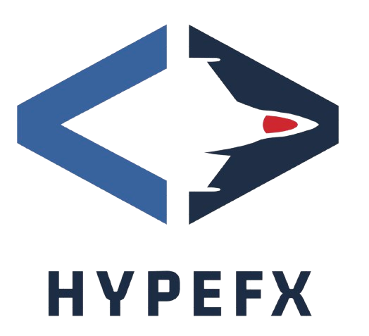

<a href="https://github.com/harish876/hypefx"></a>

## Hypefx - Build Simple SPA's using Go and HTMX

Framework to build Web Apps using Go and HTMX.

### Feature Overview
 
- CLI which provides:
    - Boilerplate Code generation for Scaffolding a Go + HTMX + Tailwind Project
    - File Based routing which (can be opted out of).
    - Static and Incremental Site generation.
    - Adding a lightweight headless UI component library.
- Uses <a href="https://github.com/labstack/echo " >Echo</a> for serving HTTP requests, rendering pages and middleware.
- Uses <a href="https://github.com/a-h/templ">Templ</a> for templating UI Components in Go.


## [Guide](https://echo.labstack.com/guide)

### Installation

```sh
go install github.com/harish876/hypefx  // release build
go install --build=test github.com/harish876/hypefx // test build
```

Verify the installation by using the below command.
```sh
hypefx --version
```

### Example

Use the generate commnd to scaffold a new project.
```sh
hypefx generate [go_module_name]
```
This generates a project structure with the necessary dependencies and runs the go mod init command to initialize the go project. Run the commands on the console output to install and setup the dependencies.

Run this command to generate the routes.
```sh
hypefx build routes
```
This creates a routes.go file with routes according to your file structure defined in your app directory.

Now add the below line in your cmd/main.go. ( I plan to automate this step in the future)
```go
package main

import (
	"github.com/labstack/echo/v4"
)

func main() {
	app := echo.New()
	app.Static("/", "assets")

    //Add this line as below
    routes.RegisterRoutes(app)

	app.Logger.Fatal(app.Start(":42070"))
}
```

## Future Plans
1. This is very much a WIP but...
2. I have a lot of cool stuff planned for this, I want to remove many small bugs in the code and improve code quality.
3. Make nightly builds and automate a few of these manual processes listed under the "Usage" section.
4. Improving file-based routing by baking it into the dev server, removing multiple dependency commands, and integrating them into one.
5. Add a ton of batteries for common utilities found in web apps and things I use in my day-to-day life.

## Use issues for everything

- For a small change, just send a PR.
- For bigger changes open an issue for discussion before sending a PR.
- PR should have:
  - Test case
  - Documentation
  - Example (If it makes sense)
- You can also contribute by:
  - Reporting issues
  - Suggesting new features or enhancements
  - Improve/fix documentation
